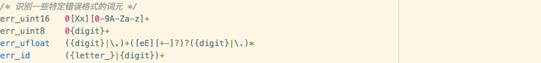
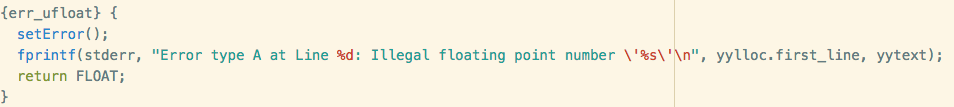
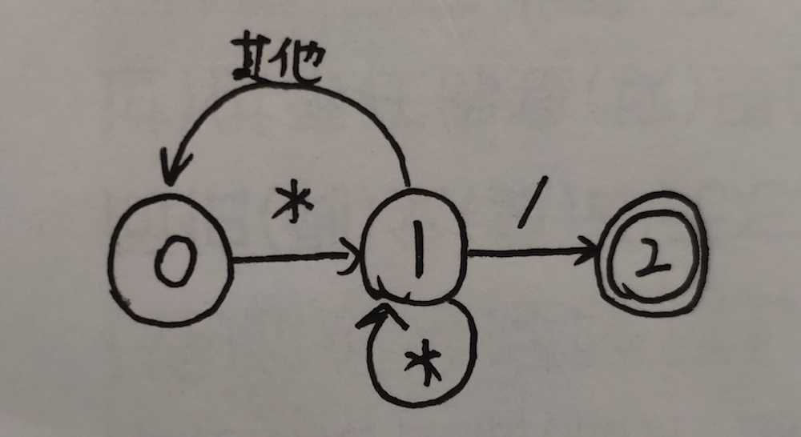
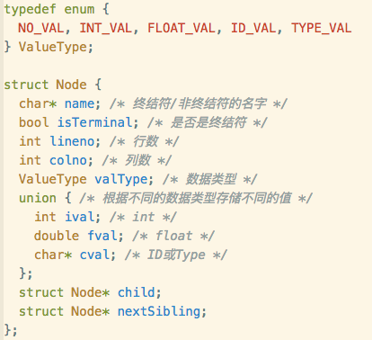
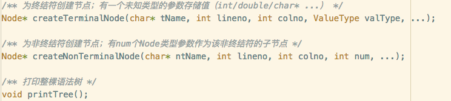

### 实验报告（一）

- 曹洋笛  161220004  2904428882@qq.com

#### 一、功能描述

1. 词法分析与语法分析
2. 错误查找，给出错误类型以及行号
   - 词法错误：Error type A
     - 非法字符：Mysterious characters
     - 非法十六进制数：Illegal hexadecimal number
     - 非法八进制数：Illegal octal number
     - 非法小数：Illegal floating point number
     - 非法ID：Illegal id
     - 注释尾部缺失：Missing Comment End ‘*/’
   - 语法错误：Error type B
3. 打印语法树（对于分析无误的代码）
4. 实现额外功能
   - 要求1.1： 识别八进制数和十六进制数
   - 要求1.2： 识别指数形式的浮点数
   - 要求1.3： 识别“//”和“/*…*/”形式的注释

#### 二、亮点

1. 更多的词法错误类型

   词法错误不仅包括非法字符，还包括非法的数字与ID。通过在lexical.l中定义正则表达式的顺序，把错误的数字格式定义在正确的格式之后，可以把大部分程序员手滑而打错的数字和ID拦截在词法分析的步骤（lexical.l的34-38行），为了防止语法分析再次报错，在规则部分为这些错误的格式返回一个理想中的正确值以欺骗语法分析（lexical.l的291-313行），以非法浮点数为例：

   

   

2. “/**/”注释的特殊处理

   对于此词元，当检测到“/*”时进入state0，随后使用input()接收字符（lexical.l的61-85行），状态机如下（其他指除了'\*'或'/'之外的字符）：

   

   一旦读到文件结尾都未发现注释尾部，则报词法错误，并给出注释头的行数和文件尾的行数。

3. 语法树节点的数据结构

   定义ValueType，以区分不同节点不同类型的值；

   采用联合类型union，以存储不同类型的值（Tree.h的10-27行）：

   

#### 三、代码简析

- Tree.h/Tree.c：

  包括3个主要函数：

  

- lexical.l：

  - #define YYSTYPE Node*：将yylval的类型全部定义为节点
  - 定义部分：一群正则表达式
  - 规则部分：调用 yylval = createTerminalNode(...)

- syntax.y：

  - 定义部分：定义tokens，以及运算的优先级和结合性

  - 规则部分：调用 $$ = createNonTerminalNode(...)，连接各个节点，形成语法树；

    将error符号放在 ";"/")"/"]"/"}"之前，以进行再同步，并打印一些细节信息（这些信息比如“Missing ';'”可能并不能指出真正的语法错误原因，如果助教感到困扰的话，在main.c里注释掉第16行“showDetail();”来关闭这个显示细节的功能吧）

  - 用户代码：重定义void yyerror(const char* msg)函数以打印自己的报错信息

- main.c

  - 当第14行“yyset_debug(1);”没有注释掉时，打印最详细的分析过程（仅方便Debug）
  - 当第16行“showDetail();”被注释掉时，语法错误将不打印错误细节，仅打印“syntax error”的字样（默认此行是注释掉的）

#### 四、运行

直接用Makefile的命令就很不错，`./parser [filename]`当然也是可以的

#### Tips

- 如果打印语法错误的时候串行了（该有的内容不会少的），emmm，这可能是showDetail()开启+词法错误Mysterious characters的奇妙反应（稀有状况），鉴于这个问题没有太大影响以及改起来太麻烦，先放在那里了，毕竟showDetail()的内容Missing ";"之类的本来就不准……

- 可以在Mac终端上运行哦，只不过要使用另一个Makefile：`make -f Makefile_Mac`

